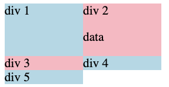
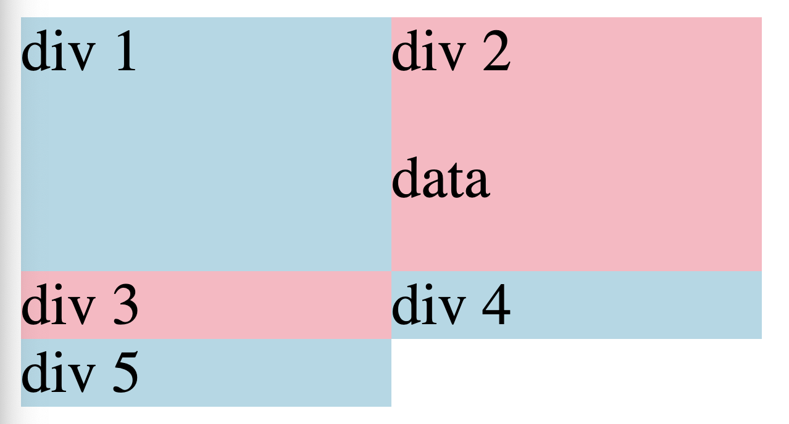

Grid is basically devided into rows and columns, imagine columns and rows similar to Swing assuming X and Y axis.

### Grid aligns vertically.


I wantedly added an extra para in div2 however div1 and div2 are vertically aligned.

To create Grid we need two properties

```java
.main-div{
    display: grid;
    grid-template-columns: 100px 100px;
    // In the above step we defined how many columsn do we need and width of them.
}
```

In the below HTML file we have 5 div elements however we declared onyl 2 columns in `main-dev`, 

```java
<body>
    <div class="main-div">
        <div class="div1">div 1</div>
        <div class="div2">div 2
            <p>data</p>
        </div>
        <div class="div3">div 3</div>
        <div class="div4">div 4</div>
        <div class="div5">div 5</div>
    </div>
</body>
```

In this scenario the third div wraps around to a second row. `so when ever we have more elements than the columns css automatically wraps the components around and creates new rows.` like in the below attached screen shot.




## fr( free space)

we followed inline css here. column with `fr` occupies the rest of the space in the page.


screen shot clearly shows 1fr occupying hte rest of the space in web page.

```java
<div style="
        display: grid;
        grid-template-columns: 100px 1fr;
        margin-top: 15px;">

        <div style="background-color: lightblue;">100px</div>
        <div style="background-color: lightsalmon;">1fr</div>
    </div>
```