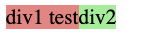
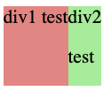

FlexBox is nothing but a flexible box, The box just expands as much space sa it needs to observe below screenshots.




second screen shot occupied as much space as it just needed.

Flex box also aligns vertically like the grid.



> To just make the box to occupy the rest of webpage like `1fr in grid` we simply use `flex: 1`

```java
<div style="
        background-color: lightgreen;
        flex: 1;
        ">div2
        <p>
            test
        </p>
</div>
```
