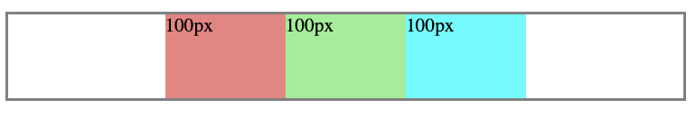

FlexBox is nothing but a flexible box, The box just expands as much space sa it needs to observe below screenshots.


second screen shot occupied as much space as it just needed.

Flex box also aligns vertically like the grid.


> To just make the box to occupy the rest of webpage like `1fr in grid` we simply use `flex: 1`

```java
<div style="
        background-color: lightgreen;
        flex: 1;
        ">div2
        <p>
            test
        </p>
</div>
```

## justify-content

### `justify-content: center`



### `justify-content: space-between`


### align-items: stretch

let's add an another style `align-items: stretch`, and stretch is the default style of aligning items. This would look similar to the above image.

### align-items: start


### align-items: center


similarly end moves the components to the bottom.

```java
<div style="
        margin-top: 30px;
        height: 70px;
        border-style: solid;
        border-color: grey;
        display: flex;
        flex-direction: row;
        justify-content: center;
        ">

        <div style="
        background-color: lightcoral;
        width: 100px;
        ">
            100px
        </div>

        <div style="
        background-color: lightgreen;
        width: 100px;
        ">
            100px
        </div>

        <div style="
        background-color: cyan;
        width: 100px;
        ">
            100px
        </div>
    </div>
```
